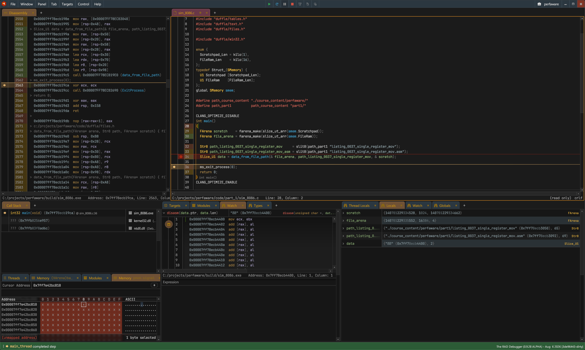

# Computer Enhance: Performance Aware Programming Course

```
git -C . config --local diff.ignoreSubmodules all
git -C . config --local status.submoduleSummary false
git -C . config --local submodule.recurse false
```

## Gallery

Part 1: File read!

